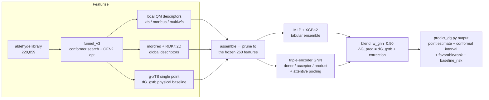
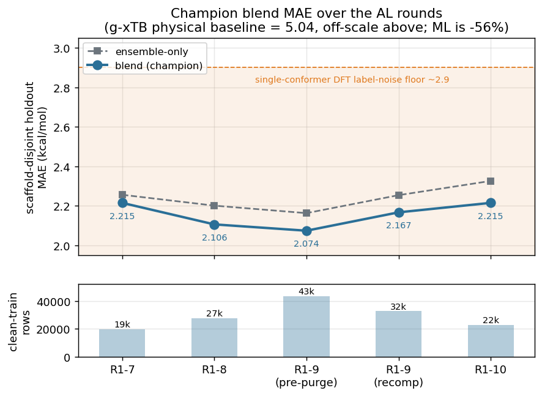
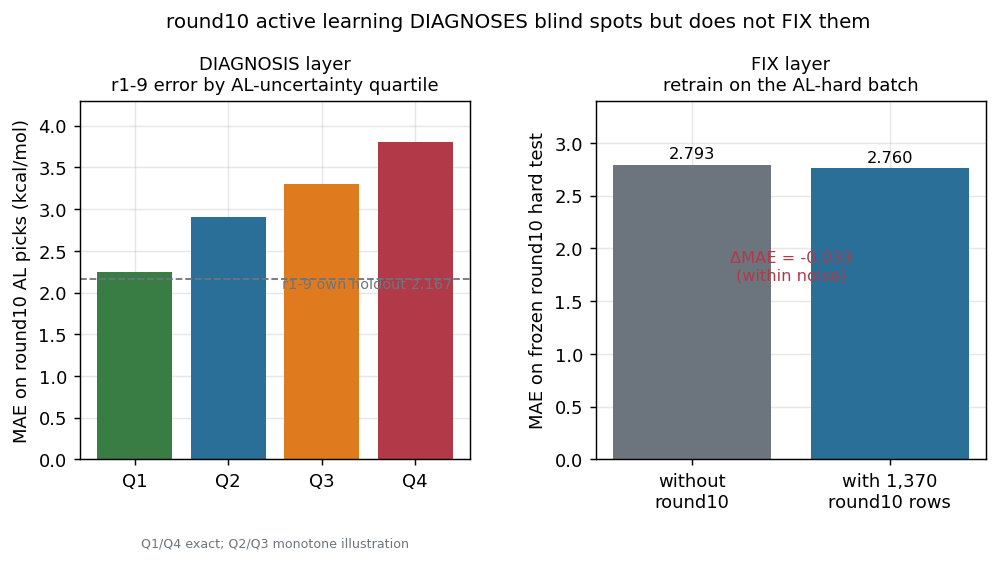
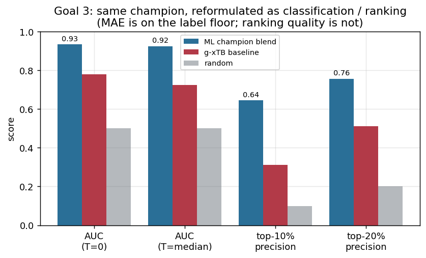
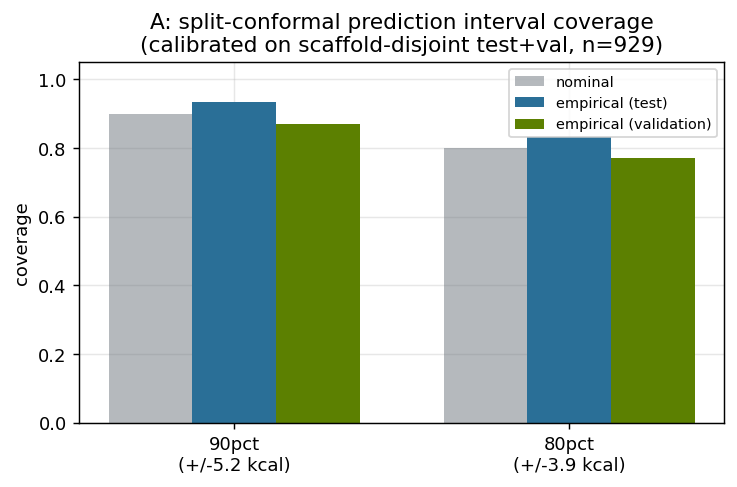
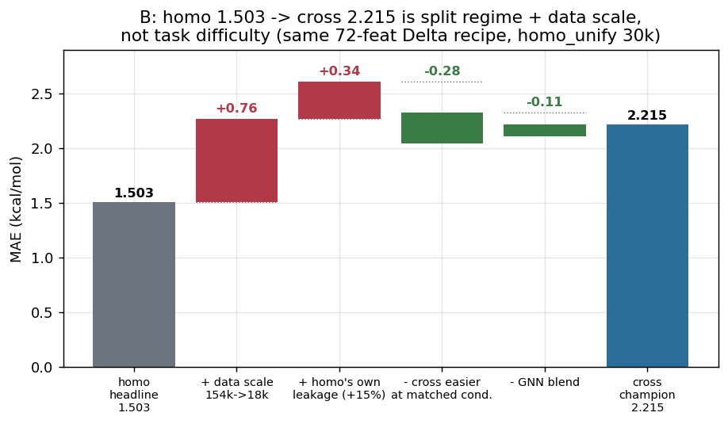
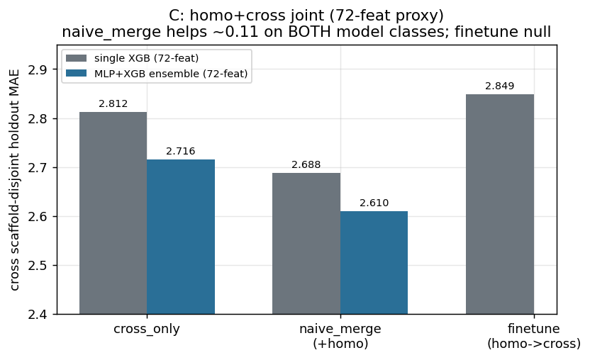
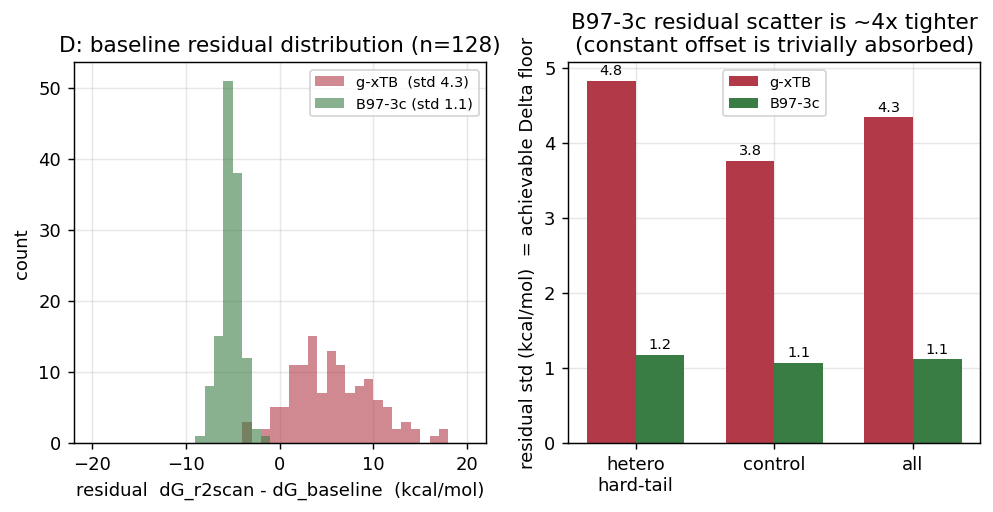

# benzoin-dg project summary (2026-09-07) — active-learning-driven cross-benzoin ΔG prediction

> **Supersedes `PROJECT_SUMMARY_20260904.md` as the reporting document.** The 09-04
> version is kept as a historical snapshot. This version is re-organised around the
> **active-learning (AL) main line + ΔG prediction**, compresses the two sister
> sub-projects (BDE / homo dG) into a quick overview (§7), and folds in the four
> "open-thread review" items closed on 09-07 (§6).
>
> Chinese version: `PROJECT_SUMMARY_20260907.md` (keep the two in sync).
> Day-by-day detail: `RUN_LOG_20260903.md`. Technical reference:
> `ALDEHYDE_LIBRARY_AND_DG_WORKFLOW_20260907_EN.md`.

---

## 0. One line + key numbers

**Goal**: given a pair of aldehydes (donor + acceptor, may be the same molecule),
predict the benzoin-condensation ΔG (kcal/mol); use active learning to pick the
most informative next batch of DFT calculations, turning "which reaction pairs are worth
a DFT run" from blind selection into a model-driven ranking problem.

| milestone | number |
|---|---|
| AL rounds | **10 full closed-loop rounds** (round1→round10), started 2026-07-14, round10 landed 2026-09-04 |
| current champion | **r1-10 blend** (MLP+XGB tabular ensemble ⊕ triple-encoder attentive GNN, w_gnn=0.50) |
| champion honest MAE (scaffold-disjoint holdout, n=448) | **2.215 kcal/mol** (g-xTB physical baseline 5.037, **−56%** vs baseline) |
| training data | 35,528 rows / 22,771 clean-train rows (cumulative DFT labels over 10 AL rounds) |
| **label-quality ceiling** | single-conformer r2SCAN-3c DFT label noise std ≈ **2.9 kcal/mol** — the champion MAE is already on the floor |
| **round10 AL ablation** | AL *diagnosed* real blind spots, but the training benefit is **≈0** (−0.03, within noise) |
| **geometry-method bias ablation** | three-species ΔΔG: hetero median −0.47 vs control −0.25 kcal, both under the 1 kcal threshold → **no bias, label-quality investigation closed** |
| **reformulation as classification / ranking** | the same champion as a favorable/unfavorable classifier: **AUC 0.92-0.93**, top-10% precision **64%** (g-xTB baseline 31%, random 10%) — **not capped by the label-noise ceiling**, a standard `predict_dg.py` output column since 09-07 |
| **homo/cross gap (new 09-07)** | at matched split regime + data scale, cross ≈ homo (if anything slightly ahead); the homo 1.503 "advantage" is a random split + 12× more training data, **not task difficulty or label quality** |
| **cheap-baseline lever (new 09-07, pilot)** | swap in B97-3c as the Δ-learning baseline: residual scatter std **4.32 → 1.11** (ratio 0.26) → possibly the first real accuracy lever in months; pending a production-geometry re-check + full-recompute validation |
| sister sub-project: BDE prediction | champion B6 5-seed deep ensemble, scaffold-disjoint full 220k: aldehyde MAE **1.851** / product **2.826** |
| sister sub-project: homo dG (A+A, deployed) | 219,364 DFT labels, full coverage, champion test MAE 1.503 (random-split regime) |

---

## 1. Problem setup

### 1.1 Chemistry + learning framework

- **Reaction**: donor aldehyde + acceptor aldehyde (may be the same) → benzoin-type
  product.
- **Predicted quantity**: `dG_orca_kcal`, r2SCAN-3c / CPCM(DMSO) single point,
  `dG = G(prod) − G(donor) − G(acc)`, geometry from the funnel_v3 conformer search.
- **Δ-learning**: `dG_pred = dG_gxtb physical baseline + ML correction`. The ML only
  learns the correction, not the prediction from scratch — an order of magnitude more
  data-efficient. The g-xTB baseline itself has MAE 5.037; the ML corrects it to 2.215.
- **Features**: a 260-dim frozen schema (local QM descriptors + a curated mordred subset
  + RDKit 2D), unchanged since round7. mordred is 46%, RDKit 2D 19%, local QM ~35%.
  Hand-built `interaction_*` pair features were tried — none made the final list (the
  GNN half learned them implicitly).
- **Model**: single XGB → MLP+XGB ensemble → **+ a 50/50 blend with an attentive-pooling
  triple-GNN** (three architecture generations, see §3).
- **Evaluation**: a Bemis-Murcko **scaffold-disjoint** held-out set, fixed at n≈448 since
  2026-07-17.

**End-to-end workflow + blend architecture:**

Δ-learning only learns the `dG_orca − dG_gxtb` correction; labels are needed only for
the training set (AL-selected pairs get a DFT run).

### 1.2 Why active learning is the main line

- ~1.24M unlabelled candidate aldehyde pairs; DFT single points are expensive. The core
  question is not "can dG be predicted" but "**where does the next batch of DFT compute
  buy the most information**".
- round1 used class diversity to spread coverage; from round2 on it is all **bootstrap
  ensemble uncertainty AL** — score the candidate pool with the current champion, select
  the next batch by descending prediction variance.
- Over ten rounds the core question evolved into: **to what extent did AL actually move
  the model** (§3, takeaway 3).

---

## 2. The ten AL rounds (timeline)

| version | date | clean-train | ensemble-only MAE | GNN-only MAE | **blend MAE** | notes |
|---|---|---:|---:|---:|---:|---|
| R1-3 | 07-14~15 | ~2,472 | — | — | 2.966(CV)† | class-diversity sampling |
| R1-5 | 07-16 | — | — | — | 2.633† | first triple-encoder GNN, P=0.987(n=29) |
| R1-6 | 07-16 | — | — | — | 2.582† | GNN did not replicate, P=0.456(n=29) |
| R1-7 (old split) | pre 07-17 | ~27,583 precursor | — | — | 1.883(CV)† | screen10k candidate pool exhausted |
| **R1-7 (scaffold-disjoint re-estimate)** | 07-17 | 19,687 | 2.256 | — | **2.215** | honest number after the leakage correction |
| R1-8 | 07-20 | 27,583 | 2.201 | 2.324 | **2.106** | attentive-pooling GNN introduced, P=0.9923 |
| R1-9 (pre-purge) | 07-21 | 43,367 | 2.163 | 2.162 | **2.074** | learning curve supports continuing, P=0.988 |
| **R1-9 (post-purge recompute)** | 09-04 | ~32,630 | 2.254 | 2.313 | **2.167** | labels recomputed from scratch, P=0.9954 |
| **R1-10 (current champion)** | 09-04 | 22,771 | 2.326 | 2.313 | **2.215** | + round10 AL batch, P=0.99855 |

(† = old-split numbers from before the 2026-07-17 scaffold-leakage correction — **do not
cite as real accuracy**. The pre- and post-purge r1-9/r1-10 numbers are not directly
comparable — the underlying DFT labels were recomputed and the scaffold split rebuilt.)

The blend consistently beats ensemble-only (P>0.99 each round), but all 5 versions'
blend MAE sit in a **narrow 2.07–2.22 band** — more data barely moves it, because it is
already on the label-noise floor (§3 takeaway 4).

**Four key turning points:**

1. **2026-07-17 scaffold-leakage correction.** The early "molecule-level (InChIKey
   disjoint)" split left 93% of the old frozen holdout's scaffolds already present in
   train. An independent scaffold-disjoint 5-fold CV confirmed a real, reproducible
   **+0.221 MAE (~9.8%) generalisation gap**. Every historical "frozen holdout MAE" had
   over-stated true generalisation by 0.2–0.5. A true scaffold-disjoint 80/10/10 split
   was rebuilt (clean test set expanded to n≈450), all numbers re-estimated — more
   honest, worse. The BDE sub-project independently hit the same trap (+43~47%), so this
   is not a one-off.

2. **From 2026-07-20 the GNN turns around with scale.** The round1-7 GNN blend was null;
   round1-8 with attentive pooling made it robustly significant (P=0.9923); by round1-10
   the GNN weight is still rising (0.40→0.50). **"A null architecture comparison at small
   data" does not extrapolate to larger scale.**

3. **2026-07~29 full Snellius scratch purge.** round8/9 DFT labels, the aldehyde-side
   r2SCAN-3c SP cache, all GNN weights, the BDE descriptor libraries — all lost
   (gitignored + no home backup). Systematic recovery from 2026-09-02: bit-exact
   re-stitching from home backups where possible, recompute from scratch otherwise
   (~41.5k single points). round1-7 reproduction check: CV MAE 1.877 vs historical 1.883
   (within noise) — recovery trusted.

4. **2026-09-04 round10 landed + AL ablation.** round10's three DFT legs completed (1,969
   new labelled pairs), r1-10 champion confirmed. The two-layer round10 AL evaluation is
   in §3, takeaway 3.

---

## 3. Methodological takeaways (the five that matter most after ten rounds)

1. **Honest evaluation beats good-looking numbers.** Scaffold leakage retracted every
   historical number by 0.2–0.5 MAE at once, and both sub-projects hit it independently.
   For any "frozen holdout" number, first ask "were the test scaffolds seen in train".

2. **The GNN blend's benefit emerges with scale.** round1-7 null → robust from round1-8
   → weight still rising at round1-10. Architecture comparisons must be done at the target
   data scale; small-data conclusions do not extrapolate.

3. **AL can diagnose blind spots; it does not guarantee it can fix them.** round10 is the
   first time this project measured the two separately:
   - *Diagnosis layer*: r1-9 blend on the 1,969 AL-selected round10 pairs has MAE
     **2.780** (vs 2.167 on its own frozen holdout, 28% worse); uncertainty ⟂ true error
     Pearson r=0.40 (p=9e-77), MAE rises monotonically from Q1 2.245 to Q4 3.798 by
     uncertainty quartile. **AL genuinely picked real blind spots.**
   - *Fix layer*: freeze 30% of the round10 batch (589 rows) as a hard test set, train
     the same ensemble with vs without the other 70% (1,370 rows) → ΔMAE = **−0.033**
     (within noise). **Training on those 1,370 AL-hard examples barely changes accuracy.**
   - Likely causes: +6.6% marginal data; the AL-hard cases are "irreducible-noise hard"
     not "coverage hard"; at ~21k-pair scale this 260-dim feature set is near plateau.
     **Recommendation: no more ~2k-scale AL rounds.**

   

4. **The label-noise floor is a hard constraint.** Three independent lines converged on
   2026-09-04:
   - conformer-noise probe (32 products × K=5 conformers): `dG_std` mean **2.975** /
     median 2.884; single-conf vs Boltzmann-average label diff |mean| only 0.15 kcal →
     **multi-conformer relabelling is null** (twice independently confirmed on homo, this
     is the 3rd).
   - the round10 AL fix-layer null (takeaway 3).
   - 2026-07-21: three 3D-GNN architectures (attentive3d / distattn / …) all landed
     blend MAE **2.177–2.188** → real 3D geometry gives no clear win over 2D+attentive.
   - as MAE approaches the label's own noise std, more same-kind data / more model
     capacity → marginal benefit goes to zero.

5. **Reformulating the target sidesteps the label-noise ceiling.** See §5.

---

## 4. Label-quality investigation and closure

**Motivation**: champion MAE 2.215 is approaching the ~2.9 label-noise floor → either
upgrade the label or reformulate the problem. Three "label-upgrade" levers were checked:

| lever | probe | result |
|---|---|---|
| multi-conformer Boltzmann relabel | `confnoise_cross` (32 products × K=5) | ❌ null (§3 takeaway 4) |
| change geometry method (GFN2 → g-xTB refine) | `geom_bias` (12 heteroatom-heavy products, one-sided energy) | structured product-side bias: hypervalent P(=O) −9.2, polysulfonyl −5.0, boron −4.2 kcal — looks like a lever |
| change functional level (r2SCAN-3c → wB97X-3c) | `wb97x_shift` | ❌ parser couldn't handle range-separated output, lowest priority, cancelled |

**Decisive ablation `dg_geom_method` (closed 2026-09-04)**: `geom_bias` only looked at
the product side. But `dG = G(prod) − G(donor) − G(acc)` is a difference — if the three
species' geometry biases point the same way, the donor/acceptor sides **cancel** the
product-side bias. 60 pairs (35 heteroatom-heavy + 25 control), all three species get
GFN2-opt and g-xTB-opt (**g-xTB refines from the GFN2 minimum, does not re-search** — v1
used an independent re-search and the result was conformer noise masquerading as
geometry bias, fixed) → r2SCAN-3c SP → `ddG = dG_gxtb − dG_gfn2`.

| group | n | median ddG (kcal) | range |
|---|---:|---:|---|
| hetero (heteroatom-heavy) | 34 | **−0.47** | −5.22 ~ +2.84 |
| control | 25 | **−0.25** | −4.43 ~ +1.96 |

`rmsd_prod_med = 0.20 Å` (<0.3 sanity threshold, confirms it's not conformer noise).
Both medians are far under the 1 kcal decision threshold, same sign, heavily overlapping
→ **the product-side geometry bias cancels into ΔG; no significant label bias.**

**Closure**: no targeted g-xTB/r2SCAN relabel campaign; the champion stays r1-10; all
effort redirects to Goal 3. **Do not re-raise targeted relabelling absent new evidence.**

---

## 5. Goal 3 — deployment + reformulation as classification / ranking

### 5.1 Reformulation validated positive (2026-09-04)

**Without retraining anything**, take the frozen r1-10 champion blend's continuous
predictions on its own n=448 holdout and reformulate post-hoc:

| metric | ML (champion blend) | g-xTB physical baseline | random |
|---|---:|---:|---:|
| Spearman rho (predicted vs true ranking) | **0.884** | — | 0 |
| T=0 binary AUC / acc / F1 | **0.934 / 0.911 / 0.697** | 0.781 / 0.752 / 0.448 | 0.5 |
| T=train-median binary AUC / acc / F1 | **0.924 / 0.848 / 0.835** | 0.726 / 0.632 / 0.689 | 0.5 |
| model top-10% precision among the true best 10% | **0.644** | 0.311 | ~0.10 |
| model top-20% precision among the true best 20% | **0.756** | 0.511 | ~0.20 |

Even though the continuous MAE is stuck on the floor, the champion's **ranking /
classification quality is very good** (AUC 0.92-0.93) and **far above the g-xTB baseline**
on every slice. A deployable-today output not bound by the label-noise ceiling.

### 5.2 The deployment tool `predict_dg.py` (standard output since 2026-09-07)

Scores any new molecule pair end to end (featurize → assemble → prune → blend inference).
Output columns:
- `dG_pred_kcal` (point estimate), `ens_member_sigma` (cheap directional uncertainty)
- **Reformulation trio**: `dg_favorable` (dG<0), `dg_below_train_median`, `dg_rank_pct`
  (within-batch percentile, for ranking a candidate batch)
- **Deployment-hardening trio (added 09-07, see §6 A)**: `dG_pi_lo_90`/`dG_pi_hi_90`
  (split-conformal 90% interval), `baseline_risk`/`baseline_risk_motifs` (g-xTB baseline
  failure substructure flag), `dg_high_sigma` (OOD guard)

**Cross-sub-project bug (introduced 09-06, fixed 09-07, commit `c520acf`)**: the 09-06
full BDE library rebuild chose a coverage sentinel field (`G_gxtb`) that BDE doesn't need
but cross-dG does, silently making `predict_dg.py` fail 100% on every new pair. Fix:
switch the sentinel to the 99.9%+-populated `donor_xtb_HOMO`; `G_gxtb` falls through to
median-impute if missing. Lesson: **any change to a shared library file's schema must be
followed by the `predict_dg.py` 20-pair smoke test.** The `G_gxtb` gap itself was also
backfilled 09-07 (array `26432805`, coverage 1.3% → 99.07%).

---

## 6. 2026-09-07 open-thread review: A / B / C / D

The user pushed back on "the project is quiescent" and named open threads (homo/cross
gap, S/P handling, g-xTB value, Δ-learning, GNN architecture). After a full read, the
threads were sorted into "resolved" vs "still open", and four items were pursued:

### A — `predict_dg.py` deployment hardening ✅ shipped (commit `0a2d5f7`)

`build_predict_dg_calibration.py` → `predict_dg_calibration.json` (scaffold-disjoint
test+val residuals, n=929). Added:

- **`dG_pi_lo_90` / `dG_pi_hi_90`**: split-conformal 90% prediction interval, ±5.24
  kcal, distribution-free marginal coverage ≥ 90% (empirically 0.94 test / 0.87 val).
  The interval is wide because the point estimate sits on the label floor and the
  residuals are heavy-tailed. **The σ-normalised variant was no tighter** →
  `ens_member_sigma` has too little conditional signal; the global one shipped.
- **`baseline_risk` / `baseline_risk_motifs`**: hypervalent P / sulfonyl / sulfoxide /
  nitro / N-oxide / Se / triflate SMARTS. Holdout-validated: flagged rows blend MAE
  **2.86 vs 2.10**, |g-xTB baseline error| **6.35 vs 4.81** (mirrors the homo hard-tail
  corr(residual, baseline error)=0.888). `baseline_risk=True` = route to DFT.
- **`dg_high_sigma`**: `ens_member_sigma` > calib p99 (2.81 kcal) → OOD, trust neither
  the point estimate nor the interval.

The champion itself and its MAE 2.215 are unchanged.

### B — homo/cross ΔG gap decomposition ✅ done

`homo 1.503` (random split, full 219k) and `cross 2.215` (scaffold-disjoint, 23k) are
cited side by side but are **not the same ruler**. On `homo_unify_v1` 30k (the only homo
data that kept `dG_orca` + a scaffold split post-purge), same 72-feat Δ recipe:

| condition | n_train | MAE | g-xTB baseline MAE |
|---|--:|--:|--:|
| homo, **random** split | 18,197 | **2.265** | 4.09 |
| homo, **scaffold-disjoint** split | 19,030 | **2.608** | 4.43 |
| *cross ensemble-only (scaffold-disjoint, 22,771)* | 22,771 | *2.326* | *5.04* |

**homo 1.503 → cross 2.215 (+0.712 kcal) decomposes as:**

| step | ΔMAE | what it is |
|---|--:|---|
| homo 1.503 → homo random @18k 2.265 | **+0.762** | pure **data scale** (154k→18k), same random-split regime |
| → homo scaffold-disjoint @19k 2.608 | **+0.343 (+15%)** | homo's **own leakage premium** (interpolation → extrapolation) |
| → cross ensemble-only @23k 2.326 | **−0.282** | at matched split regime + scale + architecture the **cross task is actually easier** |
| → cross blend 2.215 | **−0.111** | the GNN blend homo does not have |

**Conclusion: the gap is split regime + data scale, not task difficulty or label
quality.** At matched conditions cross ≈ homo, if anything slightly ahead. homo's leakage
premium is +15%, in the same family as cross's +9.8% and BDE's +43% — "molecule-level
split ≠ scaffold generalisation" is a three-way-confirmed, task-independent effect. homo
scaffold-disjoint MAE 2.61 is well above homo's own ~2.1 floor → at matched conditions
homo is **data/generalisation limited**, while cross blend sits on the ~2.9 floor → cross
is closer to "done".

See `data/analysis/homo_cross_gap/FINDING.md`. **Do not re-raise "the cross task is
harder".**

### C — homo+cross joint tabular 🟡 AMBER-GREEN

"Open problem 1" (homo+cross joint training) was last tested at ≤17k cross rows and
shelved as a shrinking benefit. Now cross has 23k + homo 26k (~1:1 ratio), 72-feat
shared space, eval on the cross scaffold-disjoint holdout:

| | single-XGB | MLP+XGB ensemble |
|---|--:|--:|
| cross_only | 2.812 | 2.716 |
| naive_merge (+homo, +is_homo flag) | **2.688 (−0.124)** | **2.610 (−0.106)** |
| finetune (homo → cross continue-train) | 2.849 (null) | — |

`naive_merge` improves ~0.11 kcal on **both model classes** → reproducible, not a
"data-starved model likes rows" artefact. `finetune` is null. Opposite of the pre-purge
BDE-side finding, because here homo:cross ≈ 1:1 (no dilution); at full 6:1 scale the
dilution returns unless homo is down-weighted.

**Verdict: worth a bounded next step** — build the full 260-schema featurization for the
30k homo_unify set (mordred + assemble, ~1-2 days) + retrain the cross ensemble/GNN with
homo down-weighted to 1:1, and check whether the −0.1 survives to the 260-feat + GNN
champion; only then invest in GNN homo-pretrain (**the current champion GNN is cross-only
— the homo-pretrain path was never rebuilt after the purge**). Not a blank cheque.

### D — better cheap Δ-learning baseline pilot ✅ 128/128 done, AMBER-GREEN (leaning GREEN)

DFT arbitration found the g-xTB↔r2SCAN-3c gap is dominated by the **single-point method
level** (|Δ_SP| ~16 vs |Δ_geom| ~5) → the one untested accuracy lever is "swap in a
better-but-still-cheap single point as the Δ-learning baseline". g-xTB (semiempirical) →
**B97-3c** (a GGA composite functional, ~5-20× cheaper than the r2SCAN-3c label).

128 pairs (64 heteroatom hard-tail + 64 control), one fresh GFN2 geometry per species,
then g-xTB / B97-3c / r2SCAN-3c single points on that identical geometry →
`resid_gxtb` vs `resid_b973c` conformer-noise-free. **128/128 done, 0 errored:**

| residual = `dG_r2scan − dG_baseline` | mean\|·\| | **std** | mean (signed) |
|---|--:|--:|--:|
| g-xTB baseline | 6.00 | **4.32** | +5.75 |
| B97-3c baseline | 5.24 | **1.11** | **−5.24** |

The B97-3c residual is a near-constant ~−5.24 kcal **offset** (mean|·| ≈ |mean_signed| →
almost pure offset) + std ≈ **1.11**. A Δ-learning model trivially absorbs a constant
offset → **the achievable floor is set by the std**: g-xTB **4.32 → B97-3c 1.11** (std
ratio **0.26**). On the hardest heteroatom hard-tail (g-xTB std 5.1) B97-3c still holds
std 1.2.

**Reading**: `merge_cheap_baseline_pilot.py` mechanically returns AMBER (its GREEN
threshold also requires mean|·| to drop a lot, but mean|·| is dominated by the −5.24
constant offset, which a Δ-model trivially absorbs) — **substantively closer to GREEN**:
the std ratio 0.26 is decisive; switching to a B97-3c baseline drops the Δ-model's
theoretical floor from ~4.3 to ~1.1, **potentially pushing the champion MAE well below
2.215**. That would be the first real accuracy lever in months.

⚠️ **Trap**: the one-shot ETKDG/GFN2 geometry is ~18 kcal off the production funnel_v3
labels, and the pilot's three SPs share one geometry → the std 1.11 is "pure
level-of-theory scatter" with no conformer noise (production adds that on top). But the
B97-3c↔r2SCAN-3c near-constant-offset relationship is a level-of-theory property and
likely geometry-robust. **Next steps**: (1) re-run ~30 pairs on production funnel_v3
geometries to confirm the low-scatter property; (2) if confirmed, a full B97-3c-baseline
recompute (35k pairs × 3 species) + retrain the Δ-model on the B97-3c baseline and check
whether MAE drops materially.

---

## 7. Sister sub-projects — quick overview

### 7.1 BDE prediction (bond dissociation energy)

Predict the reaction intermediates' bond dissociation energies directly (not as an input
feature for the cross project). Two target bonds: aldehyde formyl **C–H**, product
central **ketC–carbC**. Labels are this project's own g-xTB computations.

- **champion**: B6 = D-MPNN + local 3D descriptors fused through the `x_d` channel.
  Full 220k scaffold-disjoint retrain 2026-09-06: **B6 5-seed deep ensemble aldehyde MAE
  1.851 / product 2.826** (the old 42k-local-library numbers 1.579/3.060 are retired —
  different data scale, not comparable).
- **The one robust architecture conclusion**: the `x_d` fusion advantage over pure 2D
  graphs (B4/B5) (35-47 pts). Fine-grained tweaks (attentive pooling, MAB) were leakage
  artefacts under the scaffold-disjoint split.
- **Phase-3 3D BDE model: not built after investigation** — the script actually predicts
  `dG_orca − dG_gxtb` (the cross-dG target), and this architecture family was already
  null on the dG task (§3 takeaway 4).
- The g-xTB label's systematic error is dominated by the single-point level (Δ_SP −21 vs
  Δ_geom 1.6); the conformer-noise floor is ~2.1-2.7 kcal — the same class of physical
  limit as cross's ~2.9.

### 7.2 homo dG (A+A homo-coupling, deployed)

- 219,364 DFT labels covering all 220,859 homo aldehydes. Champion `ENSEMBLE72`,
  random-split test MAE **1.503**. Inference entry `benzoin_dG.predict_dG_champion()`.
- A separate model line from cross. homo active learning was done: pool-AL doesn't apply
  (the library is fully labelled); hard-tail Boltzmann relabelling is a **2×-confirmed
  null**. The hard-tail (P / sulfonyl / imine / amide) residual = **g-xTB baseline
  failure**, corr(residual, baseline error)=0.888 — at inference it should be
  substructure-routed to DFT (implemented on the cross side as the `baseline_risk` flag,
  09-07, see §6 A).
- The 09-07 B decomposition shows: at matched split regime homo is not easier than cross.

---

## 8. Infrastructure incidents (throughout)

| incident | date | impact | response |
|---|---|---|---|
| git object DB corruption | 2026-07-13 | history reset, prior commit records lost (code state kept) | unrecoverable, history counts from `25f5400` |
| **full Snellius scratch purge** | 2026-07-20~29 | B6 checkpoints, round8/9 DFT labels, all GNN weights, BDE descriptor libraries lost | systematic recovery from 2026-09-02: bit-exact re-stitch from home backups + recompute from scratch + a new "always `git add -f` results + archive via `submit_backup_recovery_artifacts.sh`" discipline |
| scratch1 inode hard quota 133% | 2026-09-03 late | account-wide EDQUOT, writes blocked | throttled the two BDE arrays + orphan janitor + switched geometry archiving to incremental tar.zst; back under quota by 01:05 |

**Common lesson**: gitignore + no home backup = one storage-policy change and it's gone
forever; automation on a shared limited resource (inode, GPU fairshare) must have
built-in monitoring + a throttle knob; in-session Monitor tasks do not survive a session,
so handoff docs need an explicit "expires with the session, must be rebuilt" note.

**First push to GitHub on 2026-09-07** (`agent/recovery-20260902` branch; the prior 92+
commits had lived only locally).

---

## 9. Current status snapshot (2026-09-07 evening)

| line | status |
|---|---|
| **cross-benzoin ΔG champion** | r1-10 blend, MAE 2.215, `CHAMPION.md` frozen, unchanged |
| **label-quality investigation** | ✅ closed, no geometry-method bias, label-noise floor ~2.9 |
| **Goal 3 deployment** | ✅ `predict_dg.py` end-to-end usable, default output has the reformulation trio + the deployment-hardening trio |
| **A deployment hardening** | ✅ shipped and pushed |
| **B homo/cross decomposition** | ✅ done — gap = regime + scale |
| **C homo+cross joint** | 🟡 AMBER-GREEN, bounded next step pending the user's call |
| **D cheap-baseline pilot** | ✅ 128/128 done, **AMBER-GREEN (leaning GREEN)**: B97-3c residual std **1.11** vs g-xTB **4.32** (ratio 0.26); next a production-geometry re-check → full B97-3c-baseline recompute |
| **BDE champion** | ✅ full retrain done, aldehyde 1.851 / product 2.826 |
| **homo dG** | stably deployed, no new action this cycle |
| **git** | pushed to GitHub, HEAD see `git log`, clean apart from the long-standing FILE_MAP.md / round9-model changes |
| **running project jobs** | only D (`26441171`) + two janitor services |
| **cluster** | genoa was drained during the day 09-07, recovered by evening; `sinfo -s` before any new job |

**Do not re-litigate:**
- champion = r1-10 (blend MAE 2.215).
- geometry-method bias = no bias, label-quality investigation closed.
- round10 AL (2k scale) = null, multi-conformer relabel = null, label-noise floor ≈ 2.9.
- 3D-GNN (cross) no clear win; Phase-3 3D BDE model not built.
- homo is not easier than cross (at matched split regime).

---

## 10. Document map

| document | purpose |
|---|---|
| **this file** | reporting document, organised around the AL main line + ΔG prediction |
| `PROJECT_SUMMARY_20260907.md` | Chinese version of this file |
| `PROJECT_SUMMARY_20260904.md` | previous version (historical snapshot, with a more detailed BDE narrative) |
| `RUN_LOG_20260903.md` | day-by-day detail (jobids / decisions / bugs, living doc) |
| `HANDOFF_20260907.md` | session handoff (§0b = A/B/C/D status) |
| `cross_benzoin/CHAMPION.md` | champion load recipe, numbers, lineage, output columns |
| `ALDEHYDE_LIBRARY_AND_DG_WORKFLOW_20260907.md` (+`_EN`) | aldehyde library history + dG workflow + descriptor-engineering technical reference |
| `data/analysis/homo_cross_gap/FINDING.md` | full numbers + decomposition for §6 B/C |
| `data/cross_benzoin/reformulation_classification_ranking_eval.json` | full §5.1 reformulation numbers |
| `pipeline/bde/STATUS.md` | authoritative entry point for the BDE sub-project |
| memory `~/.claude/.../memory/*.md` | see the `MEMORY.md` index |

---

*This version written 2026-09-07, re-organised around the active-learning main line + ΔG
prediction. The 09-04 version is kept as history. Update `RUN_LOG_20260903.md` for later
progress; edit this file incrementally only when there's an explicit reporting need.*
