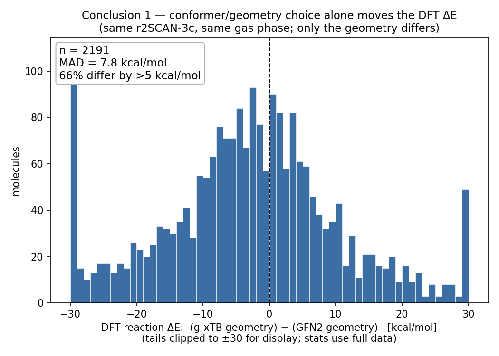
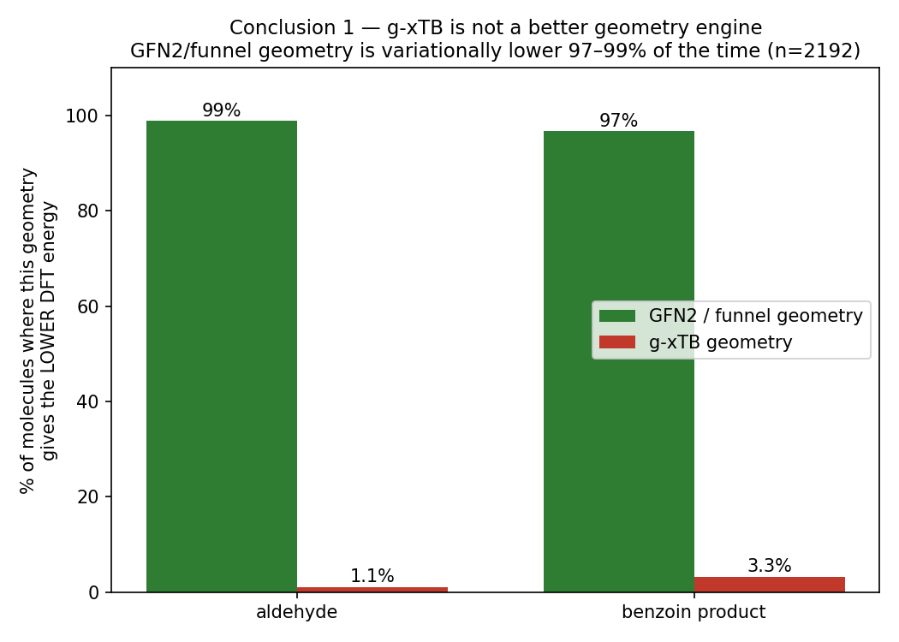
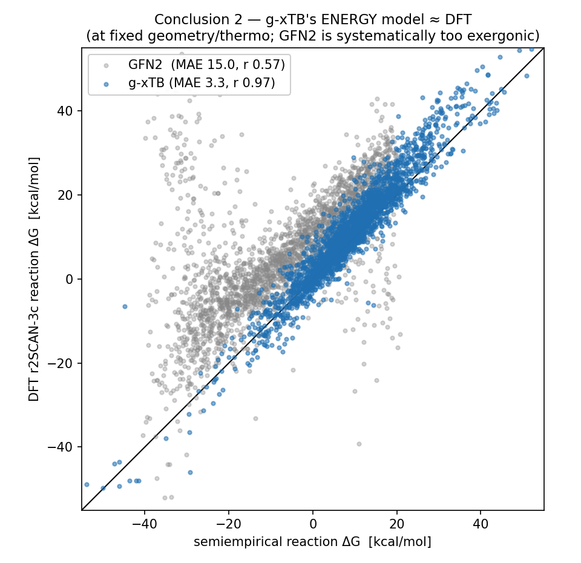
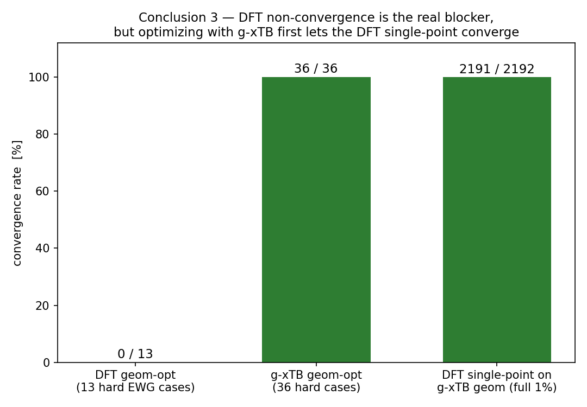

# g-xTB / xTB / DFT geometry–energy: four-figure narrative

**Figure source:** `pipeline/plot_conformer_xtb_dft_conclusions.py` (figures generated 2026-06-22)
**Data:** full-library v6 random 1% pilot (n≈2192, uniform random sample, idx spanning 34→220795) + hard-case subset

**Thesis in one line:** g-xTB's value is in the **energy**, not the **geometry**; and the real bottleneck of the whole DFT-labeling pipeline is **DFT geometry-optimization non-convergence** — optimizing with g-xTB first and then running a DFT single-point solves both problems at once.

---

## Fig 1a — geometry choice alone moves the DFT energy

**What it plots:** same r2SCAN-3c, same gas phase, **only the geometry switched** from GFN2 to g-xTB; the distribution of the resulting change in the DFT reaction ΔE (n=2191).

**Readout:**
- MAD = **7.8 kcal/mol**; **66% of molecules differ by >5 kcal/mol**; the distribution spreads from −30 to +30.

**Meaning:** geometry is not a small perturbation but a large noise source that can **drown out the method difference**. In other words, whenever the DFT and the semiempirical method use inconsistent geometries, the reaction energy picks up scatter on the order of ~8 kcal. This is exactly why the full-library parity (DFT funnel geometry vs g-xTB's own geometry) only reaches r≈0.60 — and why any fair energy comparison must **fix the geometry first**.

---

## Fig 1b — g-xTB is NOT a better geometry engine

**What it plots:** for each molecule, feed both the g-xTB geometry and the GFN2/funnel geometry into a DFT single-point and ask which geometry gives the **lower DFT energy** (variational principle: lower energy ⇒ closer to the true DFT minimum). Bars = percent of molecules where that geometry wins (n=2192, aldehyde and benzoin product counted separately).

**Readout:**
- GFN2/funnel geometry wins **99% (aldehyde) / 97% (product)**; g-xTB geometry is better in only **1.1% / 3.3%** of molecules.

**Meaning:** don't use g-xTB for geometry optimization — its optimized structures are variationally worse. The geometry step stays with GFN2/funnel_v3. This is not where g-xTB's strength lies.

---

## Fig 2 — g-xTB's energy model ≈ DFT (once geometry is fixed)

**What it plots:** semiempirical reaction ΔG (x) against DFT r2SCAN-3c reaction ΔG (y), **each method at its own fixed geometry**.
- Blue (g-xTB): `dG_gxtb_kcal` vs `dG_dft_gxtbgeom_kcal` — both on the **same g-xTB geometry**, so the only variable is the energy method.
- Gray (GFN2): GFN2 geometry / DMSO.

**Readout:**
- g-xTB: **MAE 3.3, r 0.97**; GFN2: **MAE 15.0, r 0.57**.

**Meaning (this is the key "apples-to-apples" figure):** with geometry held fixed, the only variable left is the electronic-energy method, so what is measured is the **pure energy-model quality**. g-xTB's energy is an order of magnitude better than GFN2 and sits almost on the DFT diagonal; GFN2 is systematically too exergonic (the whole cloud is shifted off the diagonal).

> ⚠️ No contradiction with the "full-library parity r≈0.60": that plot uses **different geometries** for DFT and g-xTB, mixing in the ~8 kcal geometry noise from Fig 1a. Fix the geometry → r 0.97; end-to-end full library → r 0.60. They answer different questions: this figure asks "is the energy model good?", the full-library parity asks "how large is the raw production-line g-xTB gap?".

---

## Fig 3 — the real bottleneck is DFT non-convergence; g-xTB unblocks it

**What it plots:** convergence-rate bars for three approaches.

**Readout:**
- **DFT direct geometry-opt** (13 hard EWG cases): **0 / 13** — total failure.
- **g-xTB geometry-opt** (36 hard cases): **36 / 36** — all converge.
- **DFT single-point on g-xTB geometry** (full 1%): **2191 / 2192** — nearly all converge.

**Meaning:** for strongly electron-withdrawing hard cases, DFT geometry optimization simply collapses. But once g-xTB has optimized the geometry and a DFT single-point is run on it, DFT converges and delivers the energy. The correct workflow = **g-xTB optimizes the geometry → DFT single-point takes the energy**.

---

## Putting it together

| Fig | Conclusion | Role in the pipeline |
|---|---|---|
| 1a | geometry choice swings DFT ΔE by ~8 kcal | explains why geometry must be fixed; quantifies geometry noise |
| 1b | g-xTB geometry is variationally worse (GFN2 wins 97–99%) | **geometry** goes to GFN2/funnel, not g-xTB |
| 2 | g-xTB **energy** ≈ DFT (MAE 3.3 vs GFN2 15) | g-xTB as the **energy baseline** for Δ-learning |
| 3 | DFT self-opt fails 0/13; g-xTB geom → DFT-SP unblocks | g-xTB geometry as the **fallback** for DFT convergence |

**Bottom line:** GFN2/funnel handles geometry, DFT handles energy; for the hard cases where DFT collapses, the g-xTB geometry is the fallback; and g-xTB's energy is already ≈DFT, good enough to serve as the baseline for the g-xTB→DFT Δ-learning correction. This is the foundation of the entire g-xTB→DFT correction pipeline.

**Sampling / scope notes:** the 1% pilot is a uniform random ~1% of the full library (not stratified, not evenly strided; a separately EWG-enriched hard-case set is used only for the convergence test). In Fig 2, g-xTB is gas-phase and GFN2 is DMSO, with geometries fixed per method.
